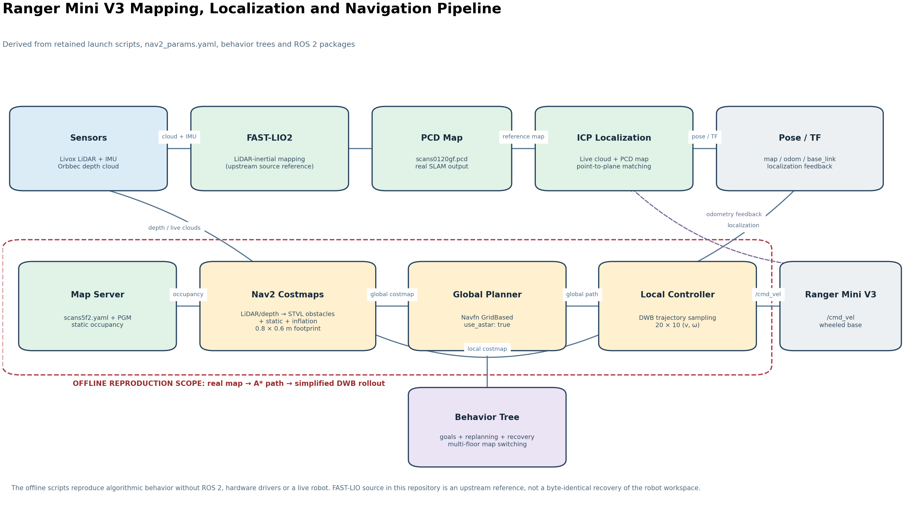
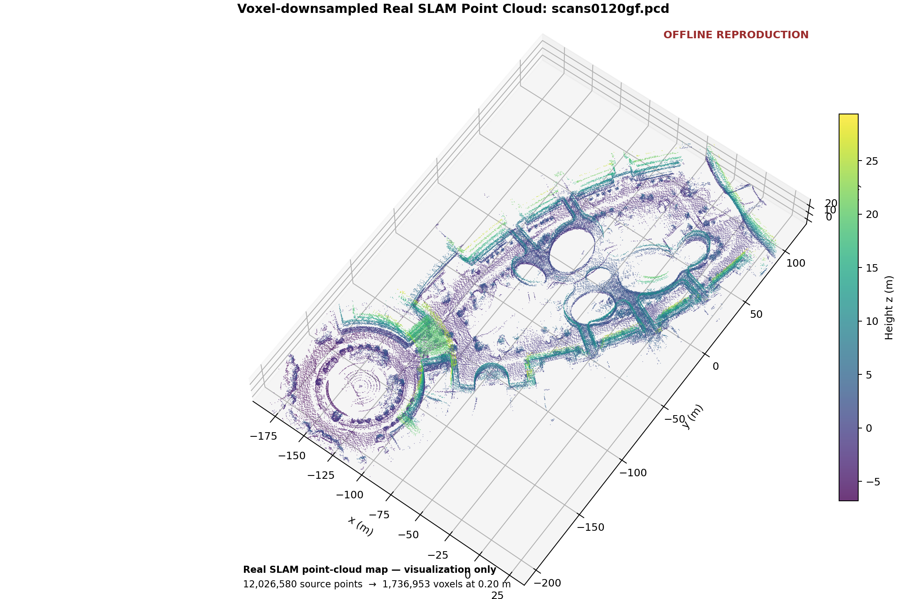
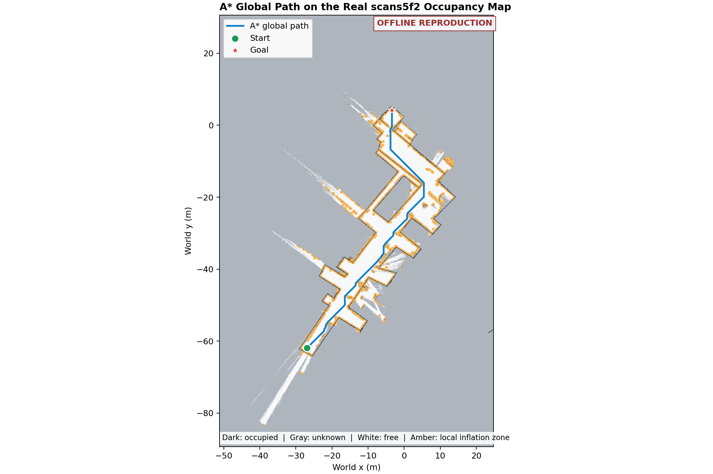
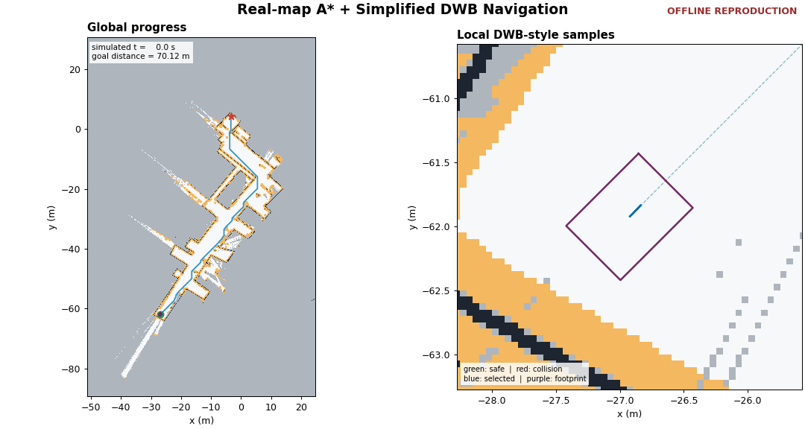

# Ranger Mini V3 Autonomous Navigation (ROS 2)

A ROS 2 Humble autonomous navigation project for the **Ranger Mini V3 wheeled mobile robot**. The system combines LiDAR-inertial mapping, point-cloud localization, Nav2 planning and control, dynamic-obstacle handling, multi-floor mission logic, and auxiliary perception tasks.

This repository is code-first: source code, configuration, behavior trees, lightweight metrics, and visualization results are included. Large raw maps, ROS bags, camera recordings, model weights, build products, and robot-specific hardware drivers are intentionally excluded.

## Highlights

- FAST-LIO2 LiDAR-inertial mapping source reference with ikd-Tree.
- Point-to-plane ICP localization against a prebuilt PCD map.
- Nav2 global planning with A* and local control with DWB.
- Static, inflation, and spatio-temporal voxel costmap layers.
- Multi-floor navigation, map switching, recovery, and task sequencing through behavior trees.
- Elevator-zone management, camera/depth-cloud processing, and YOLO task integration.
- Reproducible Python visualization using real project maps and retained navigation parameters.

## Navigation Pipeline



The retained launch scripts, Nav2 parameters, behavior trees, and ROS 2 packages describe the following pipeline: LiDAR/IMU mapping or a prebuilt map, ICP localization, static and dynamic costmaps, A* global planning, DWB local control, and `/cmd_vel` commands sent to the Ranger Mini V3 base.

## Experimental Results

### SLAM Point Cloud



The figure was generated directly from the original `scans0120gf.pcd` map with 0.20 m voxel downsampling for visualization. The geometry was not manually modified.

### A* Global Planning



The path is an offline reproduction on the real `scans5f2` occupancy map. The implementation follows ROS trinary occupancy semantics, uses the configured robot footprint and inflation radius, and runs an 8-connected A* search. The start and goal are deterministic offline test points selected from the largest safe connected region; they are not claimed to be recorded field-test waypoints.

### Offline Navigation Reproduction



> **Offline reproduction:** this animation is generated by a Python-only model using real project maps and retained navigation parameters. It is not real-robot footage and is not a bit-for-bit reimplementation of the Nav2 C++ DWB controller.

A* generates the global path, while a simplified DWB-style controller samples and scores local trajectories. Collision checks use the configured 0.8 × 0.6 m polygon footprint. The wheeled-base model has no lateral degree of freedom, so each control cycle evaluates `20 × 10 = 200` `(v, ω)` trajectories while preserving the original `vy_samples: 5` value in the parameter record.

## Repository Layout

| Path | Purpose |
|---|---|
| `assets/navigation/` | README-ready result figures and the navigation GIF. These files are displayed directly on GitHub. |
| `bt/` | Nav2 Behavior Tree XML files for goals, replanning, recovery, multi-floor map switching, perception, and arm-task sequencing. |
| `src/elevator_manager/` | ROS 2 elevator waiting-zone and cross-floor workflow nodes. |
| `src/image_saver/` | Image capture, depth-cloud forwarding, and YOLO detection nodes. |
| `src/FAST_LIO/` | FAST-LIO2 ROS 2 mapping source reference, including ikd-Tree. |
| `src/navigation2/` | Retained Nav2 packages containing project-specific changes. |
| `src/icp_localization_ros2/` | Customized ICP localization package and configuration. |
| `src/spatio_temporal_voxel_layer/` | Customized dynamic-obstacle costmap layer. |
| `python_code/` | Navigation goals, remote interfaces, notifications, and dataset-processing scripts. |
| `nav2_params/` | Nav2 planner, controller, costmap, and behavior parameters. |
| `shell/` | Robot startup, sensor TF, map/ICP switching, and YOLO control scripts. |
| `map/` | Lightweight map metadata. Large PGM and PCD map files are not tracked. |
| `offline_reproduction/` | Self-contained Python A*, point-cloud visualization, pipeline drawing, and simplified DWB reproduction. |
| `results/offline_reproduction/` | Machine-readable metrics and the exact parameters used by the offline experiments. |

See [`CODE_INVENTORY.md`](CODE_INVENTORY.md) for the detailed code inventory, [`THIRD_PARTY.md`](THIRD_PARTY.md) for upstream sources, and [`EXCLUDED_FILES.md`](EXCLUDED_FILES.md) for excluded large files.

## Requirements

- Ubuntu 22.04
- ROS 2 Humble
- Nav2 and the package dependencies declared in each ROS package
- `livox_ros_driver2` for the LiDAR pipeline
- Ranger Mini V3 hardware support through `ranger_bringup`
- The appropriate Orbbec camera driver when the depth-camera pipeline is used

Hardware drivers and external robot workspaces are not bundled in this repository.

## Build

```bash
git clone <your-repository-url>
cd ranger-mini-autonomous-navigation-ros2
rosdep install --from-paths src --ignore-src -r -y
colcon build --symlink-install
source install/setup.bash
```

Start the Ranger Mini V3 base with the external hardware package:

```bash
ros2 launch ranger_bringup ranger_mini_v3.launch.py
```

The retained deployment scripts contain several absolute paths from the original robot computer. Review and update them for your own ROS 2 workspace before running the full system. The original command notes are preserved in [`docs/original_notes.md`](docs/original_notes.md).

## Reproducing the Figures

The figures already stored in `assets/navigation/` render on GitHub without the private raw dataset. Regenerating them requires the original private PGM and PCD map data:

```bash
python -m pip install -r offline_reproduction/requirements.txt
python offline_reproduction/generate_all.py \
  --source-zip /path/to/private-project-data.zip \
  --data-root .
```

Detailed assumptions and archive requirements are documented in [`offline_reproduction/README.md`](offline_reproduction/README.md). Exact values, units, YAML keys, and offline overrides are recorded in [`results/offline_reproduction/parameters_used.json`](results/offline_reproduction/parameters_used.json).

## Scope and Limitations

- The repository includes an offline algorithm reproduction, not a Gazebo simulation or recorded real-robot video.
- The retained global inflation radius is 8.0 m, while the local value is 0.40 m. The offline reproduction uses the 0.40 m local value and records this decision explicitly.
- The included FAST-LIO2 tree is an upstream ROS 2 source reference reconstructed from the component identified in the deployment logs. It may not be byte-identical to the locally modified version used on the robot.
- The current Windows validation environment does not include a ROS 2 Humble runtime, so a full `colcon build` was not performed here.

## Data and Security

Raw PGM/PCD maps, ROS bags, captured images, YOLO weights, logs, and build products should remain outside normal Git history. Use Git LFS or release storage if those files must be distributed.

Email credentials are read from environment variables. Copy `.env.example`, configure `SMTP_USER`, `SMTP_PASS`, and `EMAIL_TO` locally, and never commit a real `.env` file.

Third-party packages retain their original license files. A separate license for the project-owned code should be selected before public release.
